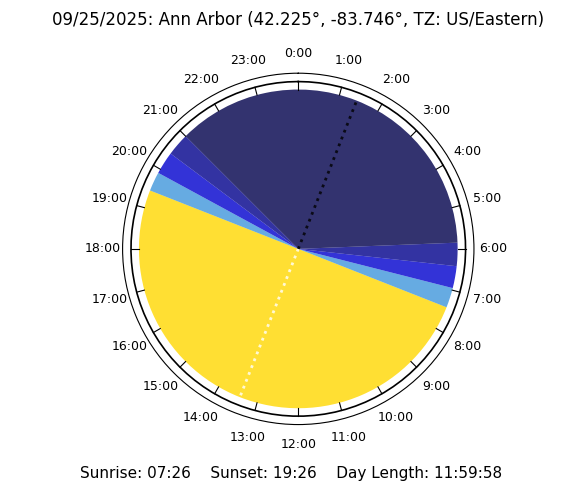

## Day Length Calculator

Creates a polar plot showing the **day length** for a specified date and location. This is defined as the period of time between **sunrise** and **sunset**, which in turn are defined as the times when the top of the Sun's disk crosses the horizon. The plot also shows **twilight**, **solar noon**, and **midnight**.

Twilight is defined as the period of time after sunset and before sunrise when the geometric center of the Sun's disk forms an angle with the horizon that is less than or equal to the specified **depression angle**  - see the **Twilight Calculation** section for more details.

Solar noon is defined as the moment when the sun is at its highest point above the observer's horizon. Note that it doesn't necessarily correspond to 12:00 PM. There are three factors that determine the size of this offset. They are, in order of decreasing size: **Daylight Saving Time** (DST), the observer's location relative to the center of their time zone, and the Sun's **Equation of Time** (EOT). The EOT represents the dfference between the **apparent solar time** and the **mean solar time**. This varies by approximately +/- 16 minutes, and is zero only four times per year - see the **Equation of Time** section for more details.

Finally, midnight is defined as the time when the sun is at its lowest point.

The sunrise, sunset, and twilight times are calculated using the ***astral*** library.

https://pypi.org/project/astral/

https://sffjunkie.github.io/astral/

### Example

 

<br> Use the ***Menu*** to select the date and location details, then update the plot. If any information is missing, the ***Update plot*** command will generate an error message. 

In the location dialog, ***Name*** is a string of the user's choosing that will appear in the plot title. The latitude and longitude should be entered as degrees in decimal format. The ***TZ identifier*** is a string that defines the oberver's time zone, including DST rules. Some commonly-used time zone identifiers can be found be selecting the ***Show time zones*** menu item.
<br>

 


### Twilight Calculation

Note that the depression angle used for the twilight calculation is adjustable. The commonly used values are 6° for **civil twilight**, 12° for **nautical twilight** and 18° for **astronomical twilight**.

https://www.weather.gov/fsd/twilight


<br> Photographers often refer to the **"golden hour"** and the **"blue hour"**. Unlike the three phases of twilight described above, these are colloquial terms lacking a strict mathematical definition. Rather, they refer to states of natural lighting that are most common around sunrise and sunset.

The warm sunlight that is characteristic of the golden hour typically occurs when the Sun is between 6 degrees above and 6 degrees below the horizon. Thus, it includes the civil twilight period plus a portion of the daylight period.

The deep blue that is characteristic of the blue hour occurs during darker stages of twilight, typically when the Sun is between 4 and 8 degrees below the horizon. Thus, it includes portions of both civil and nautical twilight.

The duration of these periods depends on both the observer's latitude and the season. In locations where the Sun is directly overhead at noon (*e.g.*, at the equator during the equinoxes) the Sun crosses the horizon at an angle of 90°, making for swift transitions between night and day and thus relatively short golden and blue hours. At higher latitudes, the duration can be much longer.

https://www.timeanddate.com/astronomy/golden-hour.html

https://www.timeanddate.com/astronomy/blue-hour.html

### Equation of Time

As mentioned previously, the Equation of Time is the difference between apparent solar time and mean solar time. The graph below shows how this varies over the course of the year. A **negative** number means the Sun is running **"slow"**; a **positive** number means it is running **"fast"**.


https://www.timeanddate.com/astronomy/equation-of-time.html

### Time Zones

Uses the ***pytz*** library to create timezone-aware **datetime** objects.

https://pypi.org/project/pytz/

https://pypi.org/project/DateTime/

https://pytutorial.com/python-pytz-time-zone-handling-made-easy/

https://en.m.wikipedia.org/wiki/List_of_tz_database_time_zones

### Python Requirements

Uses ***Matplotlib*** to display the plot.

Uses ***PySide6*** to build the ***Qt*** GUI. 

Uses ***PyInstaller*** to build the stand-alone executable.


https://pypi.org/project/matplotlib/

https://pypi.org/project/PySide6/

https://www.pythonguis.com/pyside6-tutorial/

https://pypi.org/project/pyinstaller/

<br>


https://www.qt.io/

https://doc.qt.io/qtforpython-6/

**Note**: it is recommended to create a virtual environment before installing the required libraries.

```
python -m venv venv
source venv/bin/activate  # macOS/Linux
venv\Scripts\activate  # Windows
```

To install the necessary libraries you can use the following command:
```
pip install -r requirements.txt
```
Contents of ***requirements.txt***:
```
# created by pipreqs
astral==3.2
matplotlib==3.10.1
numpy==2.2.3
PyInstaller==6.12.0
PySide6==6.8.2.1
PySide6_Addons==6.8.2.1
PySide6_Essentials==6.8.2.1
pytz==2025.1
```


To build a stand-alone exe using PyInstaller, run the following command from the terminal: 

```
pyinstaller length_of_day_app_qt.spec
```
The resulting .exe file will be located in the ```my_project_name/dist``` folder.